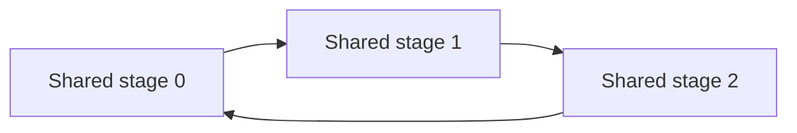
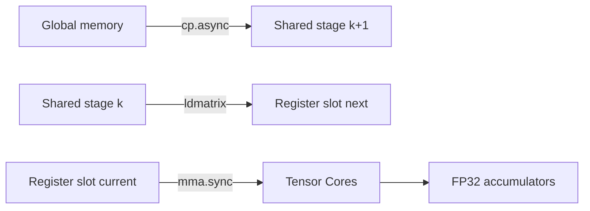

High-performance CUDA kernels are rarely limited by a single instruction. More often, performance comes down to whether the GPU can keep useful work in flight while data moves through the memory hierarchy.

A tiled GEMM is the canonical example. Each thread block repeatedly:

1. loads a tile of **A** and **B** from global memory,
2. stages those tiles in shared memory,
3. loads warp-level fragments from shared memory into registers,
4. executes Tensor Core matrix multiply-accumulate instructions,
5. advances to the next K tile.

If those phases happen strictly one after another, memory latency sits directly on the critical path. The goal of a **pipeline** is to overlap them: while the kernel computes on tile `k`, it is already fetching tile `k+1`.

This post explains how that works using CUDA's `cp.async` instruction, a multi-stage shared-memory ring buffer, and a second register-level pipeline around `ldmatrix` and `mma.sync`.

> The example that motivated this post uses a `128 × 256 × 32` thread-block GEMM tile, 256 threads, and three shared-memory stages. The ideas are general: the same producer/consumer structure appears in convolutions, attention kernels, reductions, and many other tiled GPU algorithms.

---

## 1. The synchronous version: load, stop, compute

Start with the simplest tiled loop:

```cpp
for (int k_tile = 0; k_tile < num_k_tiles; ++k_tile) {
    // Global -> shared.
    shared_a[...] = global_a[...];
    shared_b[...] = global_b[...];

    __syncthreads();

    // Shared -> registers -> math.
    compute_on_tile(shared_a, shared_b);

    __syncthreads();
}
```

Conceptually, the timeline looks like this:

```text
time -------------------------------------------------------------->

K tile 0:  [global -> shared][compute]
K tile 1:                             [global -> shared][compute]
K tile 2:                                                          ...
```

The important problem is not that global-memory loads are "slow" in isolation. The problem is that the next compute phase cannot begin until the data it needs is available.

A traditional global-to-shared copy also normally passes through a register:

```text
global memory -> register -> shared memory
```

For tiled kernels, those temporary registers are not useful computational state; they are just transport.

On Ampere-class GPUs and later architectures that support it, `cp.async` can initiate a **global-to-shared copy without waiting for it to finish immediately**. For the supported path, this also avoids using an intermediate register for the payload.

That gives us a new schedule:

```text
time -------------------------------------------------------------->

copy tile 0: [==========]
copy tile 1:      [==========]
compute tile 0:             [############]
copy tile 2:                 [==========]
compute tile 1:                         [############]
copy tile 3:                             [==========]
```

Now data movement and arithmetic can overlap.

---

## 2. `cp.async`: launch the copy now, wait later

At PTX level, a 16-byte asynchronous copy looks like this:

```cpp
__device__ __forceinline__ void cp_async_16_bytes(
    void* shared_dst,
    const void* global_src,
    int source_bytes)
{
    const unsigned shared_address =
        static_cast<unsigned>(__cvta_generic_to_shared(shared_dst));

    asm volatile(
        "cp.async.cg.shared.global [%0], [%1], 16;\n"
            :
            : "r"(shared_address), "l"(global_src)
    );
}
```

There are four details worth noticing.

### The destination is shared memory

`cp.async` is designed for the common tiled-kernel path:

```text
global memory  --->  shared memory
```

The PTX instruction takes a shared-memory address, which is why inline PTX code usually converts the generic CUDA pointer with `__cvta_generic_to_shared()`.

### The copy is non-blocking

Issuing `cp.async` does **not** mean the destination is ready on the next instruction. It starts the transfer. The kernel later uses a wait operation before consuming that shared-memory stage.

This is exactly what makes overlap possible.

## 3. A copy is not a pipeline yet

Launching one asynchronous operation is useful, but the real abstraction is a sequence of **copy groups**.

The low-level pattern is:

```cpp
cp_async_16(...);
cp_async_16(...);
cp_async_16(...);

asm volatile("cp.async.commit_group;\n" ::);
```

`cp.async.commit_group` says: all uncommitted asynchronous copies issued by this thread belong to one logical group.

Later:

```cpp
asm volatile("cp.async.wait_group 1;\n" ::);
```

The number in `wait_group N` is easy to misread.

It does **not** mean "wait for group 1." It means:

> Wait until at most `N` of the newest committed groups are still pending.

So:

```cpp
cp.async.wait_group 0;
```

waits for every previously committed group.

And:

```cpp
cp.async.wait_group 1;
```

allows the newest group to remain in flight while ensuring older groups are complete.

That second behavior is the heart of a multi-stage pipeline.

---

## 4. Why `__syncthreads()` still matters

A common mistake is to assume that `cp.async.wait_group` replaces a block barrier.

It does not.

The asynchronous groups are tracked per executing thread. In a cooperative tile load, thread 0 copies one part of the tile, thread 1 copies another part, and so on. Later, warp-level instructions such as `ldmatrix` may consume data produced by many different threads.

The safe pattern is therefore:

```cpp
wait_for_async_copy_groups<1>();
__syncthreads();

// Now the block can collectively consume this shared-memory stage.
```

The wait establishes completion of the relevant asynchronous copies for each producer. The block barrier ensures all participating threads reach the point where the shared tile is safe to consume collectively.

There is a second synchronization problem too: **stage reuse**. Before a shared-memory stage is overwritten with a future tile, every consumer must be finished reading the old tile.

A pipeline therefore has two obligations:

```text
producer must not expose a stage too early
consumer must not release a stage too early
```

---

## 5. The multi-stage ring buffer

Suppose the K dimension is split into tiles:

```text
K0, K1, K2, K3, K4, ...
```

With three shared-memory stages, we allocate a ring:



The stages are reused modulo three:

```text
K0 -> stage 0
K1 -> stage 1
K2 -> stage 2
K3 -> stage 0
K4 -> stage 1
K5 -> stage 2
...
```

The producer writes future K tiles into the ring while the consumer reads older ones.

A useful mental model is:


The write stage and read stage move independently around the same ring.

### Prologue, steady state, epilogue

Nearly every software pipeline has three phases.

#### 1. Prologue

Fill enough stages that computation can start.

For a three-stage pipeline, a common choice is to prefetch the first `STAGES - 1 = 2` tiles:

```cpp
for (int stage = 0; stage < STAGES - 1; ++stage) {
    issue_async_copy_for_one_k_tile();
    commit_async_copy_group();
}
```

#### 2. Steady state

Repeatedly:

- consume one ready stage,
- issue a future stage,
- keep one or more newer groups in flight.

This is where copying and arithmetic overlap.

#### 3. Epilogue

Drain any outstanding asynchronous work before shared storage is repurposed or the kernel exits that phase.

```cpp
commit_async_copy_group();
wait_for_all_async_copies();
__syncthreads();
```

---

## 6. Reading the three-stage GEMM pipeline

The reference GEMM uses:

```cpp
constexpr int MMA_TILE_M = 128;
constexpr int MMA_TILE_N = 256;
constexpr int MMA_TILE_K = 32;
constexpr int MMA_STAGES = 3;
constexpr int THREAD_COUNT = 256;
```

Each shared-memory stage therefore holds:

```text
A tile: 128 x 32 half = 4096 half =  8 KiB
B tile:  32 x 256 half = 8192 half = 16 KiB
                                   --------
one K stage                         24 KiB
three stages                        72 KiB
```

That arithmetic is useful because it exposes one of the main tuning tradeoffs: more stages can hide more latency, but more stages consume more shared memory and may reduce occupancy.

### The prologue

The kernel initially fills two stages:

```cpp
for (int stage = 0; stage < MMA_STAGES - 1; ++stage, --gemm_k_iterations)
{
    // A: 2 x 16-byte accesses per thread.
    for (int access = 0; access < ASYNC_COPY_ITERATIONS_A; ++access) {
        async_copy_zfill_16(
            smem_iterator_a.get(),
            iterator_a.get(access),
            iterator_a.valid(access));
        smem_iterator_a.advance();
    }

    // B: 4 x 16-byte accesses per thread.
    for (int access = 0; access < ASYNC_COPY_ITERATIONS_B; ++access) {
        async_copy_zfill_16(
            smem_iterator_b.get(),
            iterator_b.get(access),
            iterator_b.valid(access));
        smem_iterator_b.advance();
    }

    // Advance global/shared write iterators to the next K stage.
    smem_iterator_a.add_tile_offset(0, 1);
    smem_iterator_b.add_tile_offset(1, 0);
    iterator_a.add_tile_offset(0, 1);
    iterator_b.add_tile_offset(1, 0);

    commit_async_copy_group();
}
```

Per stage, the whole block transfers:

```text
A: 256 threads x 2 accesses x 16 B =  8 KiB
B: 256 threads x 4 accesses x 16 B = 16 KiB
```

Exactly one `128×32` A tile and one `32×256` B tile.

After those first two groups are committed:

```cpp
wait_for_async_copy_groups<MMA_STAGES - 2>(); // wait_group<1>
__syncthreads();
```

With three stages, `wait_group<1>` allows one newest group to remain pending while guaranteeing that sufficiently old groups are complete.

### The stage pointers are a ring

The code tracks separate counters:

```cpp
int shared_memory_write_stage = 0;
int shared_memory_read_stage = 0;
```

When the write stage reaches `MMA_STAGES`, the shared-memory iterators wrap back to the start:

```cpp
if (shared_memory_write_stage == MMA_STAGES)
{
    smem_iterator_a.add_tile_offset(0, -MMA_STAGES);
    smem_iterator_b.add_tile_offset(-MMA_STAGES, 0);
    shared_memory_write_stage = 0;
}
```

The warp-level readers do the same thing independently:

```cpp
if (shared_memory_read_stage == MMA_STAGES)
{
    constexpr int read_stage_offset =
        MMA_STAGES * WARP_GEMM_ITERATIONS;

    warp_tile_loader_a.add_tile_offset(0, -read_stage_offset);
    warp_tile_loader_b.add_tile_offset(-read_stage_offset, 0);
    shared_memory_read_stage = 0;
}
```

This is the circular-buffer invariant in concrete code: the producer and consumer both walk forward, then wrap.

---

## 7. There is a second pipeline: shared memory to registers

The most interesting part of the GEMM is that the shared-memory pipeline is not the only one.

The kernel also allocates two register-fragment slots:

```cpp
alignas(4) __half warp_loaded_fragments_a[2][32];
alignas(4) __half warp_loaded_fragments_b[2][32];
```

Before entering the inner compute loop, slot 0 is loaded:

```cpp
warp_tile_loader_a.load(warp_loaded_fragments_a[0]);
warp_tile_loader_a.advance();

warp_tile_loader_b.load(warp_loaded_fragments_b[0]);
warp_tile_loader_b.advance();
```

Then each K subgroup does this:

```cpp
const int next_warp_slot = (warp_kgroup + 1) % 2;

// Prefetch the next fragments from shared memory into registers.
warp_tile_loader_a.load(warp_loaded_fragments_a[next_warp_slot]);
warp_tile_loader_a.advance();
warp_tile_loader_b.load(warp_loaded_fragments_b[next_warp_slot]);
warp_tile_loader_b.advance();

const int current_warp_slot = warp_kgroup % 2;

// Compute with the fragments loaded previously.
mma_sync_m16n8k16(... current_warp_slot ...);
```

That is classic **double buffering**:

```text
register slot 0: consume current fragment
register slot 1: prepare next fragment

then swap roles
```

So the full kernel is better thought of as a pipeline of pipelines:



At steady state, three kinds of work are being interleaved:

```text
1. global -> shared : fetch a future K tile
2. shared -> regs   : fetch the next warp fragment
3. Tensor Core math : consume the current fragment
```

That is the real meaning of pipelining in a high-performance GEMM: keep every level fed before the level below it runs dry.

---

## 8. Minimal working example

The following kernel is deliberately simpler than GEMM. One block walks over a large vector in tiles. Each thread asynchronously copies 16 bytes—four `float`s—from global memory into one of three shared-memory stages, then doubles the values.

The arithmetic is intentionally trivial. The point is to make the producer/consumer mechanics visible.

Save as `async_pipeline.cu`:

```cpp
#include <cuda_runtime.h>

#include <algorithm>
#include <cmath>
#include <cstdlib>
#include <iostream>
#include <vector>

#define CUDA_CHECK(call)                                                   \
    do {                                                                   \
        cudaError_t err = (call);                                          \
        if (err != cudaSuccess) {                                          \
            std::cerr << cudaGetErrorString(err) << "\n";                  \
            std::exit(EXIT_FAILURE);                                       \
        }                                                                  \
    } while (0)

__device__ __forceinline__ void cp_async_16(
    void* shared_dst,
    const void* global_src,
    int source_bytes)
{
    const unsigned shared_address =
        static_cast<unsigned>(__cvta_generic_to_shared(shared_dst));

    if (source_bytes == 16) {
        // Full copy: omit the optional src-size operand.
        asm volatile(
            "cp.async.cg.shared.global [%0], [%1], 16;\n"
            :
            : "r"(shared_address), "l"(global_src));
    } else {
        // Partial copy: copy source_bytes and zero-fill the remainder.
        asm volatile(
            "cp.async.cg.shared.global [%0], [%1], 16, %2;\n"
            :
            : "r"(shared_address), "l"(global_src), "r"(source_bytes));
    }
}

__device__ __forceinline__ void cp_async_commit()
{
    asm volatile("cp.async.commit_group;\n" ::);
}

template <int PendingGroups>
__device__ __forceinline__ void cp_async_wait_group()
{
    asm volatile(
        "cp.async.wait_group %0;\n"
        :
        : "n"(PendingGroups));
}

__device__ __forceinline__ void cp_async_wait_all()
{
    asm volatile("cp.async.wait_all;\n" ::);
}

template <int TileElements>
__device__ __forceinline__ void issue_tile_copy(
    const float* input,
    float* shared_stage,
    int n,
    int tile)
{
    constexpr int ElementsPerThread = 4; // 4 floats = 16 bytes

    const int first =
        tile * TileElements + threadIdx.x * ElementsPerThread;

    int valid_elements = n - first;
    valid_elements = valid_elements < 0 ? 0 : valid_elements;
    valid_elements = valid_elements > ElementsPerThread
                         ? ElementsPerThread
                         : valid_elements;

    // Keep the source pointer valid even for a completely out-of-range tile.
    // source_bytes == 0 tells cp.async to zero-fill the destination instead.
    const float* source = valid_elements ? input + first : input;

    cp_async_16(
        shared_stage + threadIdx.x * ElementsPerThread,
        source,
        valid_elements * static_cast<int>(sizeof(float)));
}

template <int Threads, int Stages>
__global__ void scale_by_two_async(const float* input, float* output, int n)
{
    constexpr int ElementsPerThread = 4;
    constexpr int TileElements = Threads * ElementsPerThread;

    __shared__ __align__(16) float shared[Stages][TileElements];

    const int tile_count = (n + TileElements - 1) / TileElements;

    // ------------------------------------------------------------
    // Prologue: prefetch Stages - 1 tiles.
    // Out-of-range tiles simply become zero-filled stages.
    // ------------------------------------------------------------
    #pragma unroll
    for (int stage = 0; stage < Stages - 1; ++stage) {
        issue_tile_copy<TileElements>(
            input, shared[stage], n, stage);
        cp_async_commit();
    }

    // ------------------------------------------------------------
    // Steady state.
    // Before consuming tile t, launch tile t + Stages - 1.
    // ------------------------------------------------------------
    for (int tile = 0; tile < tile_count; ++tile) {
        const int future_tile = tile + Stages - 1;
        const int write_stage = future_tile % Stages;

        issue_tile_copy<TileElements>(
            input, shared[write_stage], n, future_tile);
        cp_async_commit();

        // With three stages, allow the newest group to remain pending.
        cp_async_wait_group<Stages - 2>();
        __syncthreads();

        const int read_stage = tile % Stages;
        const int first =
            tile * TileElements + threadIdx.x * ElementsPerThread;

        #pragma unroll
        for (int i = 0; i < ElementsPerThread; ++i) {
            const int index = first + i;
            if (index < n) {
                output[index] =
                    2.0f * shared[read_stage]
                                   [threadIdx.x * ElementsPerThread + i];
            }
        }

        // Every thread must finish consuming this stage before a later
        // iteration is allowed to reuse it as a write stage.
        __syncthreads();
    }

    cp_async_wait_all();
}

int main()
{
    constexpr int Threads = 256;
    constexpr int Stages = 3;
    constexpr int N = 1 << 20;

    std::vector<float> host_input(N);
    for (int i = 0; i < N; ++i) {
        host_input[i] = static_cast<float>(i % 113) * 0.25f;
    }

    float* device_input = nullptr;
    float* device_output = nullptr;

    CUDA_CHECK(cudaMalloc(&device_input, N * sizeof(float)));
    CUDA_CHECK(cudaMalloc(&device_output, N * sizeof(float)));

    CUDA_CHECK(cudaMemcpy(
        device_input,
        host_input.data(),
        N * sizeof(float),
        cudaMemcpyHostToDevice));

    // One block is intentional: this is a compact pipeline demonstration,
    // not an optimized vector-scaling kernel.
    scale_by_two_async<Threads, Stages><<<1, Threads>>>(
        device_input, device_output, N);

    CUDA_CHECK(cudaGetLastError());
    CUDA_CHECK(cudaDeviceSynchronize());

    std::vector<float> host_output(N);
    CUDA_CHECK(cudaMemcpy(
        host_output.data(),
        device_output,
        N * sizeof(float),
        cudaMemcpyDeviceToHost));

    float max_error = 0.0f;
    for (int i = 0; i < N; ++i) {
        max_error = std::max(
            max_error,
            std::abs(host_output[i] - 2.0f * host_input[i]));
    }

    std::cout << "max_error=" << max_error << "\n";

    CUDA_CHECK(cudaFree(device_input));
    CUDA_CHECK(cudaFree(device_output));

    return max_error == 0.0f ? EXIT_SUCCESS : EXIT_FAILURE;
}
```

Compile the example for an Ampere target:

```bash
nvcc -O3 -std=c++17 -arch=sm_80 async_pipeline.cu -o async_pipeline
./async_pipeline
```

Expected output:

```text
max_error=0
```

The program uses only one block so that the stage progression is easy to see. A real workload would distribute independent tile streams across many blocks.

---

## 9. Walking through the minimal pipeline

With `Stages = 3`, the prologue launches:

```text
tile 0 -> stage 0
tile 1 -> stage 1
```

At the first steady-state iteration, the kernel then launches:

```text
tile 2 -> stage 2
```

and executes:

```cpp
cp_async_wait_group<1>();
__syncthreads();
```

The newest group may still be pending, but the older groups are ready. The kernel consumes tile 0 from stage 0.

After the final barrier, stage 0 is free to be reused. The next iteration can therefore issue:

```text
tile 3 -> stage 0
```

The ring continues:

```text
iteration       consume          prefetch
------------------------------------------------
0               tile 0 / S0      tile 2 / S2
1               tile 1 / S1      tile 3 / S0
2               tile 2 / S2      tile 4 / S1
3               tile 3 / S0      tile 5 / S2
```

Notice that **the stage index is not the tile index**. It is the tile index modulo the number of stages:

```cpp
stage = tile % Stages;
```

That small modulo relationship is the essence of the circular buffer.

---

## 10. Pipeline depth: why three stages instead of two or eight?

The point of another stage is to increase the distance between "request this data" and "need this data."

If memory latency is `L` cycles and one tile provides roughly `C` cycles of independent compute, a rough mental model is:

```text
useful lookahead ≈ number_of_stages × C
```

You want enough lookahead to cover a meaningful fraction of the load latency.

But each extra stage costs resources:

```text
more stages
    -> more shared memory
    -> potentially fewer resident blocks
    -> potentially lower occupancy
```

For the reference GEMM:

```text
1 stage = 24 KiB
3 stages = 72 KiB
```

Going from three stages to four would add another 24 KiB per block. Whether that helps depends on the GPU, the kernel's register usage, the amount of Tensor Core work per K tile, and the resulting occupancy.

So pipeline depth is not "the larger the better." It is a tuning parameter.

---

## 11. The producer/consumer way to design a pipeline

When building one of these kernels from scratch, it helps to stop thinking in terms of individual instructions and instead define two actors.

### Producer

The producer owns future shared-memory stages.

Its job is:

```text
choose free stage
    -> issue global-to-shared copies
    -> commit copy group
    -> advance write pointer
```

### Consumer

The consumer owns ready shared-memory stages.

Its job is:

```text
wait until stage is ready
    -> synchronize participating threads
    -> load fragments
    -> compute
    -> release stage for reuse
```

The invariant is simple:

```text
producer never overwrites an in-use stage
consumer never reads an incomplete stage
```

Once those two rules are correct, optimization becomes much easier to reason about.

---

## 12. Common mistakes

### Mistake 1: waiting immediately after every async copy

This is correct but defeats the point:

```cpp
cp_async_16(...);
cp_async_commit();
cp_async_wait_group<0>();
```

There is no useful overlap if every copy is immediately drained.

Group enough work together and wait only when the consumer actually needs the stage.

### Mistake 2: treating `wait_group<1>` as "wait for group 1"

Again, the operand is a count of how many **newest groups may remain pending**.

```text
wait_group<0> -> drain everything
wait_group<1> -> newest one may still be pending
wait_group<2> -> newest two may still be pending
```

### Mistake 3: forgetting the consumer-side barrier

Even if the next write is asynchronous, shared memory is still being reused.

If some threads are still reading stage 0 while other threads begin overwriting stage 0 with a future tile, the pipeline has a race.

### Mistake 4: adding stages without checking occupancy

A deeper pipeline can reduce stalls and still make the whole kernel slower if the extra shared memory prevents enough blocks from residing on an SM.

Always inspect both:

```text
stall reduction
and
resident-resource cost
```

### Mistake 5: issuing tiny or badly aligned transfers

The fast path is built around naturally aligned fixed-size copies. Organize iterators so threads issue regular vectorized accesses rather than scattering many small copies.

The reference kernel does exactly that: each asynchronous operation is 16 bytes.

### Mistake 6: divergent producer schedules

Keep copy issue, commit, and wait behavior as uniform as practical across a warp. Divergent pipeline participation makes reasoning harder and can hurt the implementation of warp-shared pipeline machinery on relevant architectures.

### Mistake 7: expecting async copies to rescue a kernel with no independent work

Latency hiding requires something useful to execute while the copy is in flight.

A Tensor Core GEMM has substantial arithmetic between K-tile loads, which makes it an excellent fit. A trivial memory-bound transform may demonstrate the mechanism but may not become faster from pipelining alone.

---

## 13. Low-level PTX or `cuda::pipeline`?

The reference kernel uses inline PTX:

```cpp
cp.async.cg.shared.global ...
cp.async.commit_group
cp.async.wait_group
```

That gives very explicit control over instruction selection, grouping, and cache hints.

CUDA also exposes higher-level asynchronous-copy interfaces such as `cuda::memcpy_async` together with `cuda::pipeline` or barrier primitives. Those interfaces are usually a better starting point when you do not need to control the exact PTX sequence.

A practical rule is:

```text
start with cuda::pipeline / cuda::memcpy_async
        ↓
profile
        ↓
use lower-level PTX when exact scheduling or code generation matters
```

The mental model is the same either way: producer stages, consumer stages, and enough distance between them to overlap movement with work.

---

## 14. A checklist for pipelining a tiled kernel

When converting a synchronous tiled kernel to an asynchronous one, I use this checklist:

1. **Choose the tile.** What data must be resident in shared memory for one unit of compute?
2. **Compute bytes per stage.** This tells you the shared-memory cost immediately.
3. **Choose vectorized copy granularity.** Prefer regular aligned accesses, often 16 bytes per participating thread.
4. **Allocate multiple stages.** Usually start with two or three, then measure.
5. **Write the prologue.** Prefetch enough tiles before the first consume.
6. **Separate read and write stage indices.** Treat shared memory as a ring.
7. **Commit groups deliberately.** One logical future tile often maps naturally to one committed group.
8. **Wait as late as correctness allows.** Waiting early destroys overlap.
9. **Synchronize before collective consumption.** Especially when threads read data produced by other threads.
10. **Synchronize before stage reuse.** Do not overwrite a stage that is still being consumed.
11. **Pipeline the next level too.** Shared-to-register double buffering can matter just as much as global-to-shared staging.
12. **Measure occupancy and stalls together.** More buffering is not automatically better.

---

## 15. The main idea

Asynchronous loading is an instruction-level feature. **Pipelining is the scheduling strategy that makes it useful.**

The simplest version is:

```text
prefetch next tile
compute current tile
swap stages
repeat
```

A high-performance GEMM extends the same idea across several levels:

```text
Global memory
    |
    | cp.async: prefetch future K tile
    v
Multi-stage shared-memory ring
    |
    | ldmatrix: prefetch future warp fragment
    v
Double-buffered registers
    |
    | mma.sync: consume current fragment
    v
FP32 accumulators
```

Once you see the kernel this way, the code stops looking like a collection of iterator tricks and inline assembly. It becomes a producer/consumer system with explicit buffers and carefully chosen synchronization points.

That is the core optimization pattern: **move tomorrow's data while computing on today's data.**

---

## Further reading

- NVIDIA CUDA C++ Programming Guide, *Asynchronous Data Copies*: <https://docs.nvidia.com/cuda/cuda-programming-guide/04-special-topics/async-copies.html>
- NVIDIA CUDA C++ Programming Guide, *Pipelines*: <https://docs.nvidia.com/cuda/cuda-programming-guide/04-special-topics/pipelines.html>
- NVIDIA PTX ISA, `cp.async`, `cp.async.commit_group`, and `cp.async.wait_group`: <https://docs.nvidia.com/cuda/parallel-thread-execution/>
- NVIDIA CUDA C++ Best Practices Guide, *Asynchronous Copy from Global Memory to Shared Memory*: <https://docs.nvidia.com/cuda/cuda-c-best-practices-guide/>
